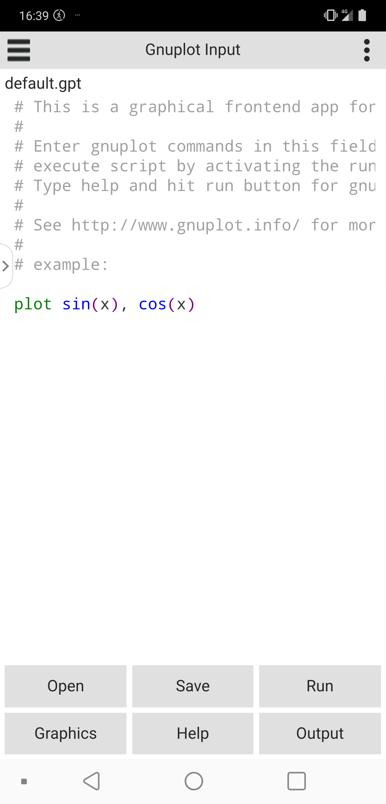
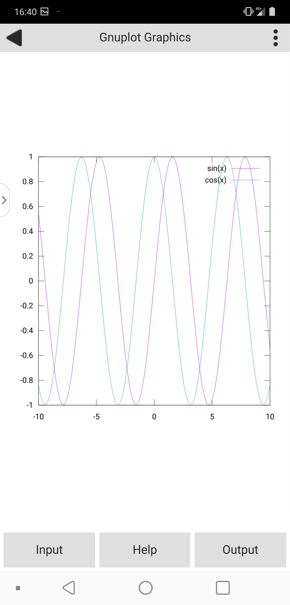

##  Mobile Gnuplot Viewer (Quick) - A graphical frontend for the [gnuplot](http://www.gnuplot.info/) program

### Description
The Mobile Gnuplot Viewer (Quick) is a frontend for the gnuplot program (which is a scientific plot program). This implementation is optimized for touch devices like mobile phones and tablets. 

 

### License  
Mobile Gnuplot Viewer Quick is released under the GPL
