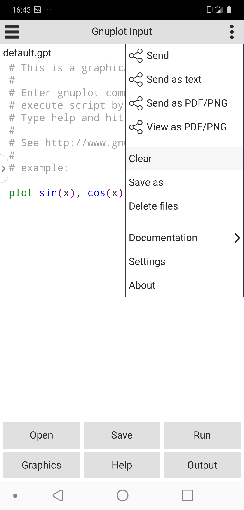

##  Mobile Gnuplot Viewer (Quick) - A graphical frontend for the [gnuplot](http://www.gnuplot.info/) program

### Description
The Mobile Gnuplot Viewer (Quick) is a frontend for the gnuplot program (which is a scientific plot program). This implementation is optimized for touch devices like mobile phones and tablets. 

All target platforms of the Qt framework are supported (Windows, Mac, Linux, Android, IOS and Webassembly). The application runs even in a [browser via Webassembly](https://mneuroth.github.io/MobileGnuplotViewerQuickWASM/).

  

Build status: 

### License  
Mobile Gnuplot Viewer Quick is released under the GPL
